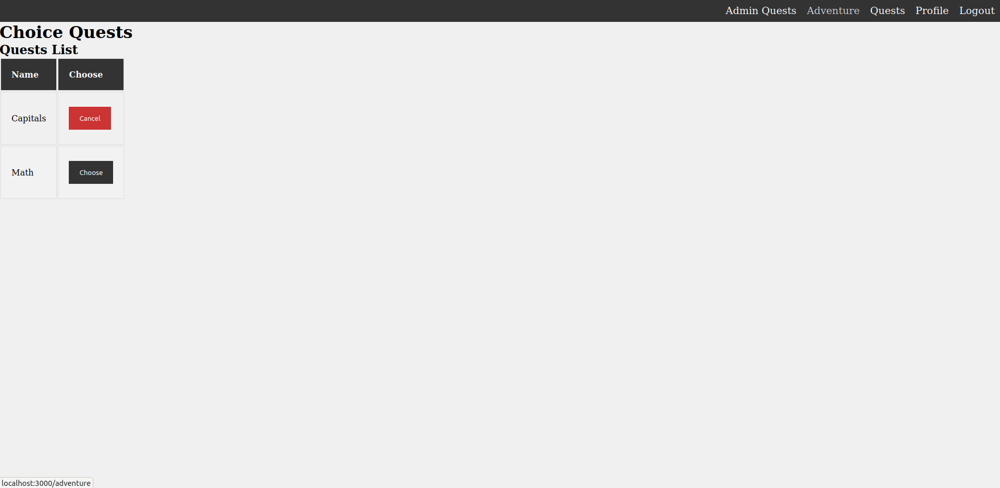
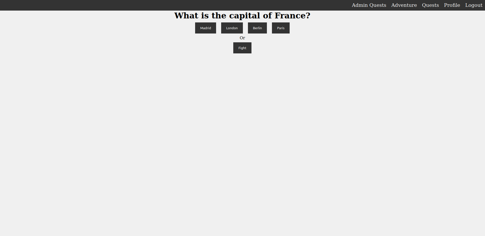
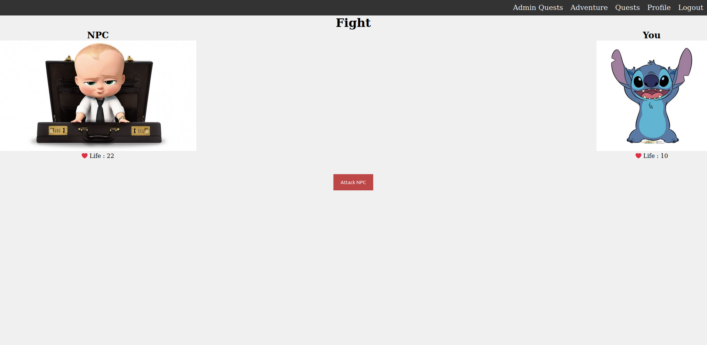
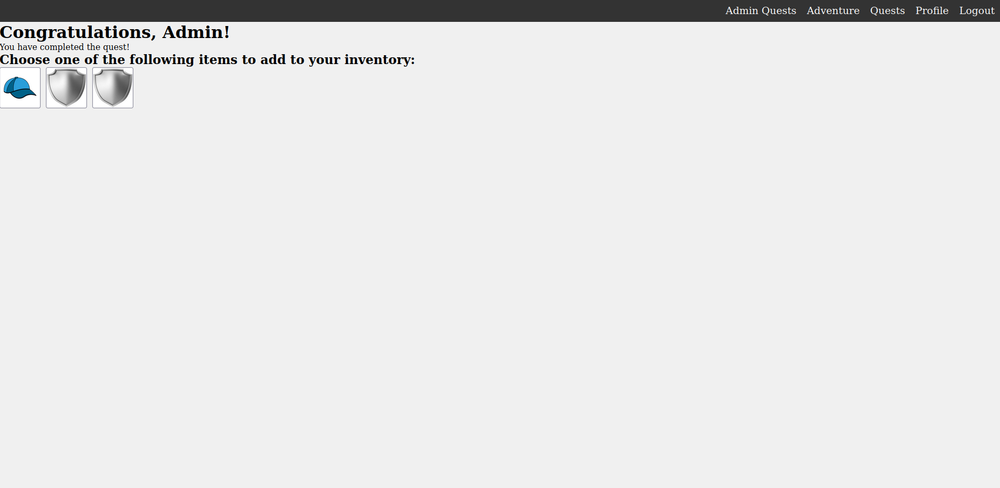
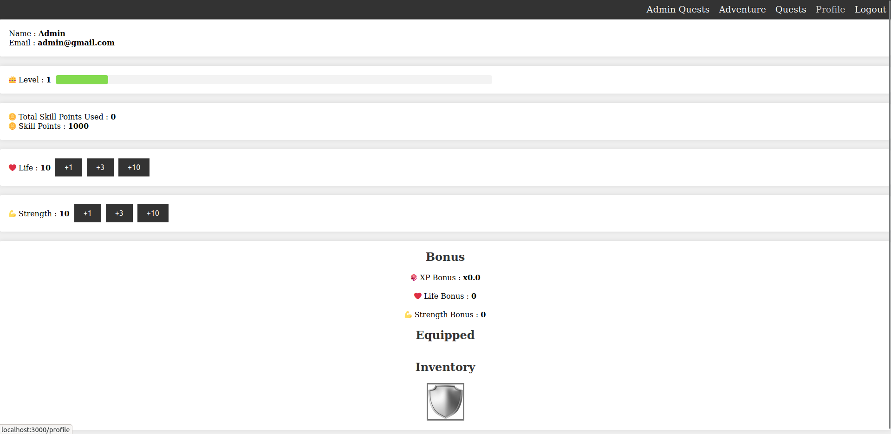

# My-RPG

## Introduction

👋 Bienvenue !

Durant ce projet effectuer en deuxième année de Web@cademie, j'ai dû faire ce projet en Ruby qui consistait à faire un RPG sur internet, avec des quêtes en QCM, combat tour par tour etc...
Durée du projet : 2 semaines

## Fonctionnalités

- Ajout de quêtes (admin)
- Ajout dé d'étape dans une quête (admin)
- Gestion du personnage 
- Système de niveau 
- Choix des quêtes
- Question à choix multiples ou combat
- Récompense en fin de quêtes

## Captures d'écran

